# 🏗️ Diagramas de Arquitetura - Site Studio

## Visão Geral do Sistema

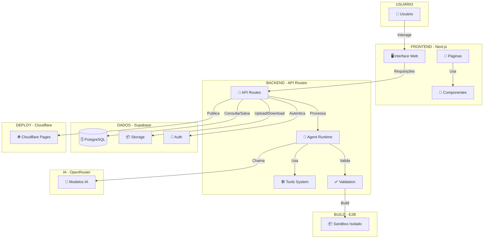

---

## Fluxo de Criação de Site

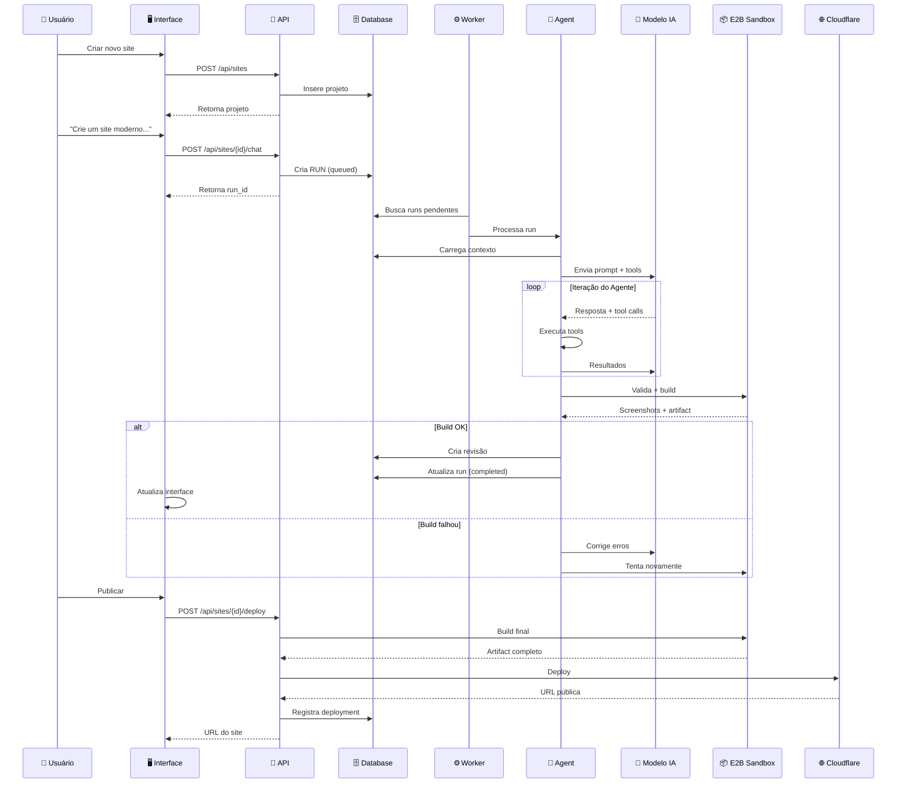

---

## Arquitetura de Ferramentas (Tools)

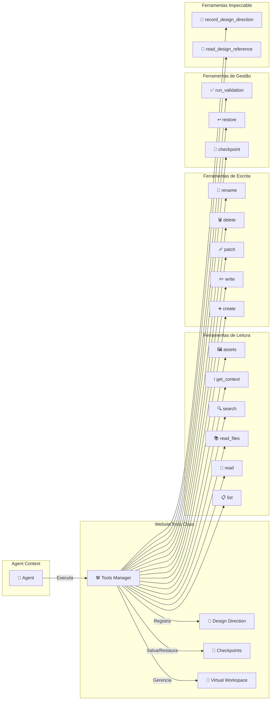

---

## Fluxo de Validação e Build

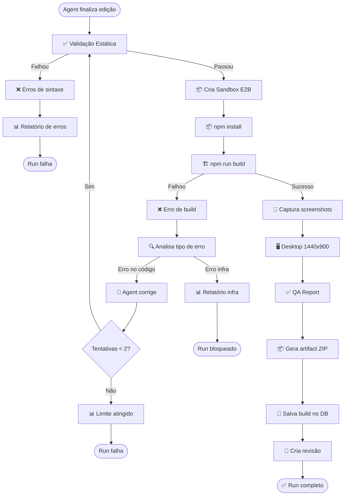

---

## Sistema de Budget

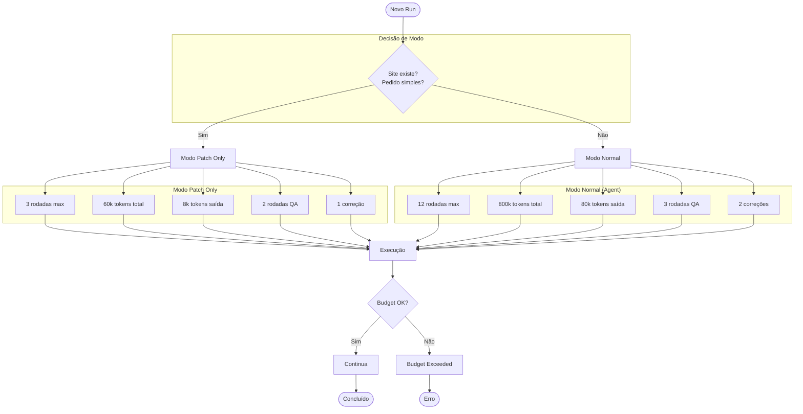

---

## Fluxo Impeccable Design

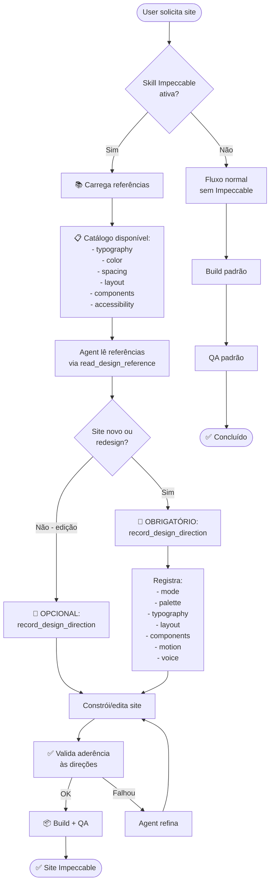

---

## Modelo de Dados

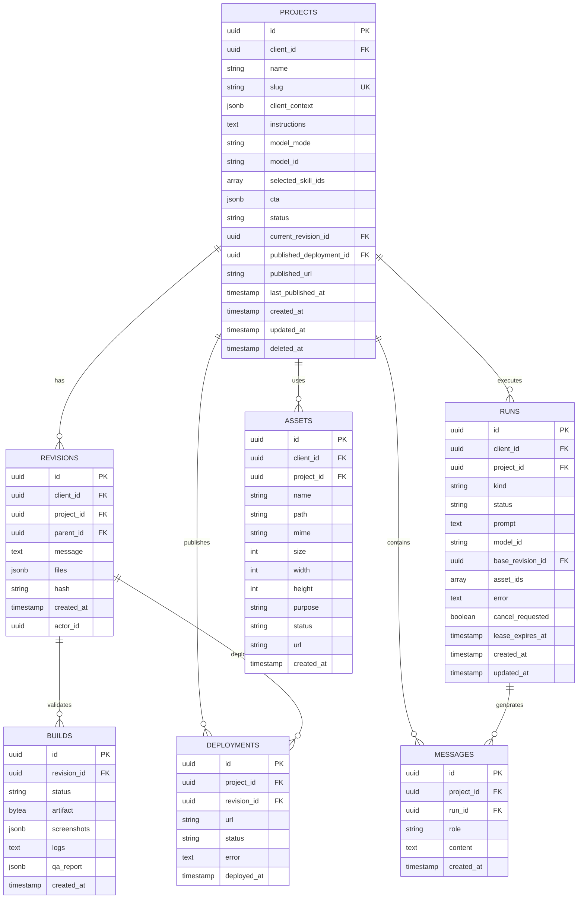

---

## Ciclo de Vida de um Run

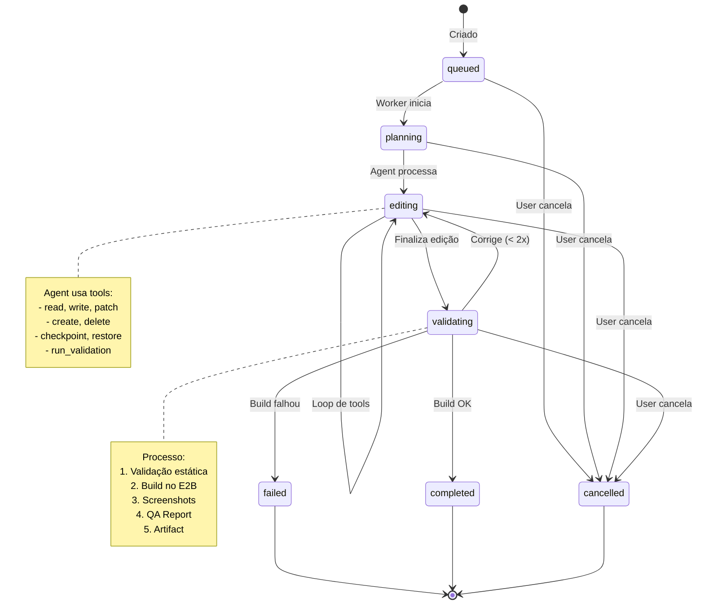

---

## Hierarquia de Skills

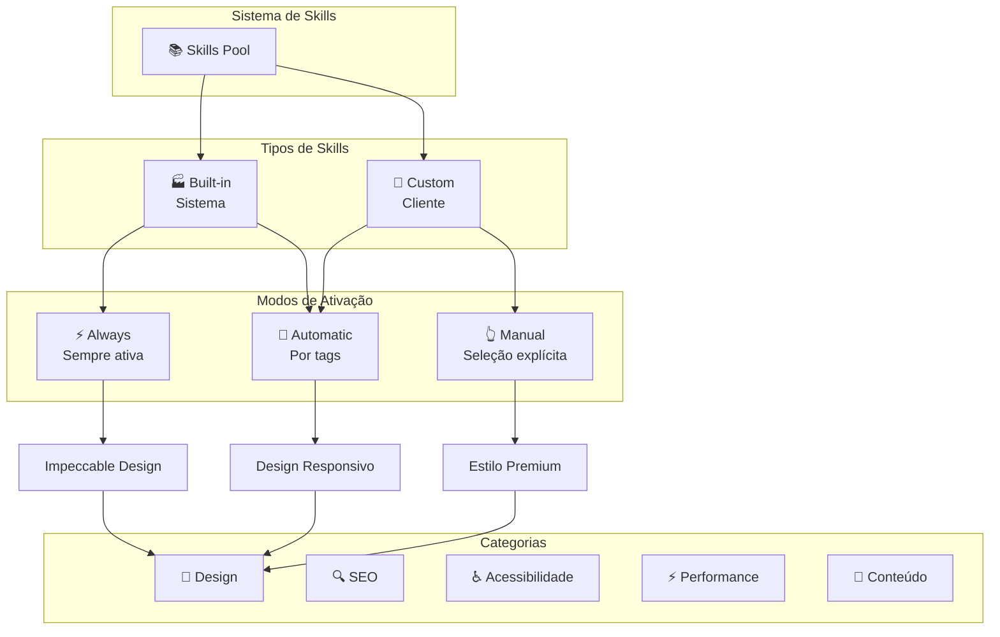

---

## Fluxo de Deploy

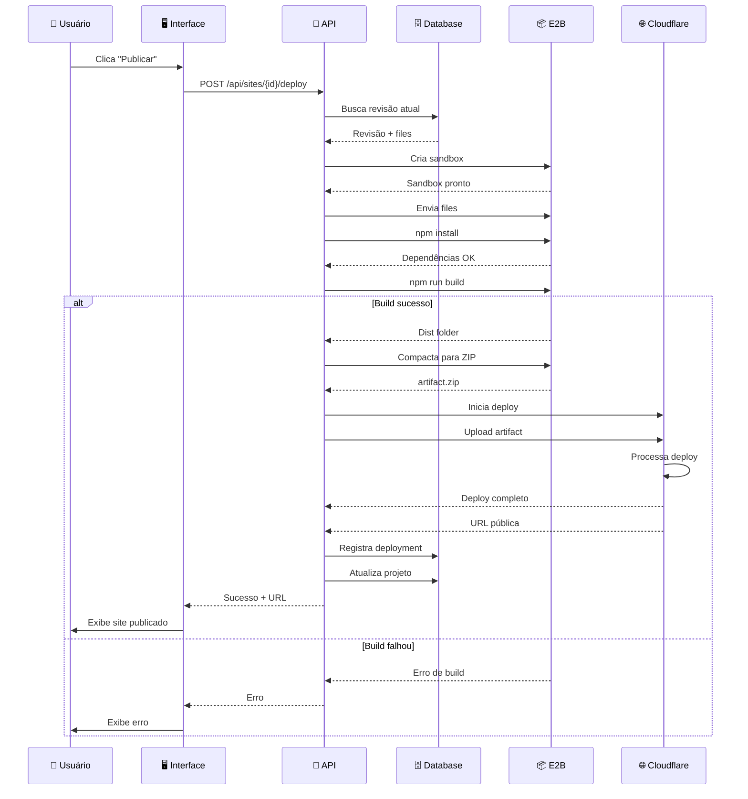

---

## Arquitetura de Checkpoints

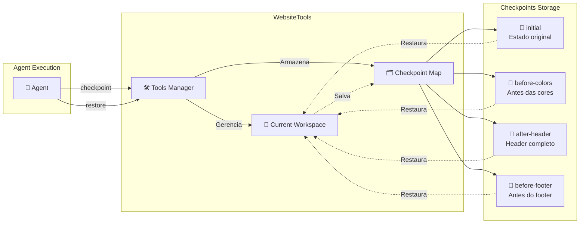

---

## Integração com OpenRouter

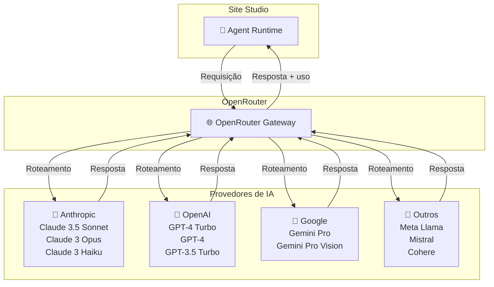

---

**Versão**: 1.0.0  
**Última Atualização**: 2024-01-08
