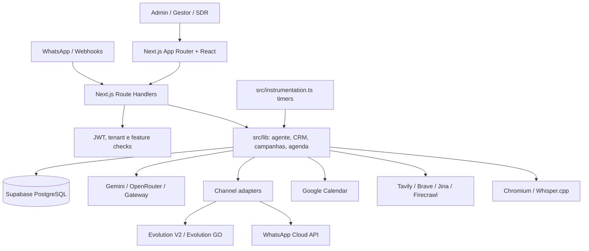
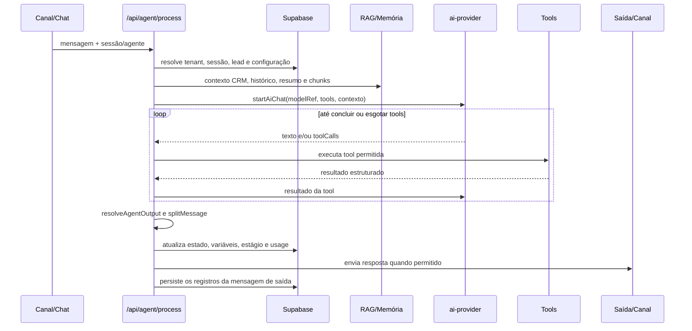

<!-- generated-by: gsd-doc-writer -->
# Contexto completo do Painel SDR para análise por IA

> Snapshot técnico consolidado em **2026-09-01**, baseado no commit local `da92e2fb1e7220890a1e9aef5555ec4649c80ea4`. Este documento descreve o que está evidenciado no repositório; não certifica o estado do banco Supabase nem o commit efetivamente implantado.

## 1. Finalidade, evidência e status

Este documento é o ponto de entrada autocontido para uma IA ou pessoa que precise entender o produto, seguir os principais fluxos, avaliar arquitetura e segurança, diagnosticar incidentes ou propor melhorias sem assumir que a documentação histórica ainda corresponde ao código.

### Ordem de confiança

Quando houver conflito, usar esta ordem:

1. Código executável e configurações versionadas.
2. Migrations e artefatos gerados, considerando que eles declaram uma intenção e não provam o estado do banco remoto.
3. Testes automatizados.
4. Documentação em `README.md` e `docs/`.
5. Estado operacional observado externamente, que é pontual e não identifica o commit implantado.

### Vocabulário de status

| Status | Significado neste documento |
|---|---|
| **Implementado** | Há código executável e caminho verificável no repositório. |
| **Opcional por configuração** | O código existe, mas depende de feature flag, credencial, configuração por tenant ou variável de ambiente. |
| **Dependente do ambiente** | O resultado depende de banco, serviço externo, imagem implantada ou configuração não comprovável apenas pelo Git. |
| **Legado/documentação desatualizada** | A afirmação ou artefato ainda existe, mas diverge do código atual. |
| **Risco conhecido** | Há evidência de falha potencial, fronteira de segurança fraca ou limitação operacional. |
| **Planejado/recomendado** | Não está implementado; é ação proposta neste documento. |

## 2. Resumo executivo

O Painel SDR, identificado na interface como **Salomão AI**, é um monólito modular multi-tenant em Next.js que reúne CRM Kanban, inbox de WhatsApp, agentes de IA, RAG, campanhas, follow-up, prospecção, automações e agenda integrada ao Google Calendar. O frontend, as rotas HTTP e os schedulers rodam no mesmo artefato Next.js. O Supabase fornece persistência PostgreSQL e integrações de Realtime/Storage pretendidas; WhatsApp pode ser atendido por Evolution API V2, Evolution GO ou Meta WhatsApp Cloud API.

| Dimensão | Estado | Evidência principal |
|---|---|---|
| Produto web e painel responsivo | **Implementado** | `src/app`, `src/components/layout/sidebar.tsx` |
| Monólito Next.js com APIs App Router | **Implementado** | `src/app/api/**/route.ts`, `next.config.ts` |
| CRM e escopo por tenant | **Implementado**, com garantias finais **dependentes do ambiente** | `src/lib/tenant.ts`, filtros `client_id`, `migrations/` |
| Agente com tools, RAG, memória e failover | **Implementado** | `src/app/api/agent/process/route.ts`, `src/lib/ai-provider.ts`, `src/lib/rag.ts` |
| WhatsApp multi-provider | **Implementado** e **opcional por configuração** | `src/lib/channel.ts`, `src/app/api/webhooks/` |
| Campanhas, follow-up, automações e agenda | **Implementado** | workers em `src/lib/*-worker.ts`, `src/instrumentation.ts` |
| Processamento distribuído com BullMQ/Redis | **Legado/documentação desatualizada** | Não há dependência BullMQ nem diretório `src/workers`; o processamento atual usa timers no processo Next.js. |
| Deploy Docker/EasyPanel | Docker **implementado**; revisão implantada **dependente do ambiente** | `Dockerfile`, `next.config.ts`, docs de deploy |
| Observabilidade centralizada | **Planejado/recomendado** | Há logs em console e tabelas operacionais, mas não há Sentry, Datadog, OpenTelemetry ou workflow de alertas detectado. |

### Números do snapshot

- 17 páginas `page.tsx`.
- 105 arquivos de rota em `src/app/api/`.
- 155 handlers HTTP: 58 `GET`, 69 `POST`, 16 `PATCH`, 12 `DELETE` e nenhum `PUT`.
- 71 arquivos `*.test.ts` rastreados pelo Git.
- 33 tabelas declaradas no setup consolidado `migrations/SETUP_COMPLETO.sql`, além de tabelas históricas/opcionais em outras migrations.
- 3 famílias de provider na abstração principal de IA: Gemini, OpenRouter e Gateway OpenAI-compatible; combos virtuais encadeiam referências dessas famílias.
- 3 canais de WhatsApp: Evolution V2, Evolution GO e WhatsApp Cloud API.

## 3. Produto, usuários e limites

### Proposta do produto

A plataforma apoia operação comercial antes e depois do primeiro contato: captar ou importar leads, organizá-los no CRM, iniciar conversas, qualificar com IA, retomar contatos sem resposta, marcar reuniões e registrar o histórico. Não há métricas de receita, conversão ou SLA verificáveis no repositório; qualquer estimativa de resultado de negócio precisa de dados reais.

### Personas e atores

| Ator | Responsabilidade | Status | Evidência |
|---|---|---|---|
| Administrador da plataforma | Cria tenants, define features e pode impersonar um cliente. | **Implementado** | `/admin/clientes`, `/api/admin/clients`, rotas de impersonação |
| Gestor comercial do tenant | Configura funil, agentes, campanhas, agenda, canais e modelos. | **Implementado** | páginas protegidas e APIs tenant-aware |
| SDR/atendente | Opera CRM e chat, envia mensagens e assume conversas do bot. | **Implementado** | `/leads`, `/chat`, `/api/send-message`, controle do agente |
| Agente de IA | Responde, consulta conhecimento, pesquisa, agenda, salva variáveis e avança estágio. | **Implementado** e **opcional por configuração** | `/api/agent/process`, tools declaradas no handler |
| Lead/contato externo | Interage por WhatsApp e pode receber campanha, follow-up ou lembrete. | **Dependente do ambiente** | webhooks e providers de canal |
| Scheduler interno | Avança automações, campanhas, follow-ups, organizer e agenda. | **Implementado**, limitado ao processo | `src/instrumentation.ts` |

### Limites explícitos

- A aplicação é multi-tenant no modelo de dados e nas rotas, mas o isolamento efetivo exige filtros corretos no código e políticas/grants corretos no Supabase real.
- Feature flags controlam principalmente navegação e páginas. Elas não formam uma autorização central para todas as APIs.
- O repositório implementa conectores e workers, mas não prova disponibilidade, limites, contratos comerciais ou configuração atual dos serviços externos.
- A aplicação não contém uma fila distribuída ativa. Escalar horizontalmente sem coordenação adicional pode duplicar timers, campanhas e tarefas.

## 4. Jornadas principais

### 4.1 Provisionar e operar um tenant

1. Um administrador autentica e acessa `/admin/clientes`.
2. As rotas `/api/admin/clients` criam ou alteram o registro em `clients`, incluindo features e configuração operacional.
3. O administrador pode iniciar impersonação; um novo cookie representa o tenant e mantém informação para retornar à sessão administrativa.
4. O menu filtra módulos por `clients.features`; valores ausentes são tratados como permitidos.
5. As APIs recuperam `client_id` do JWT com `requireClientId()` ou função equivalente e devem aplicar esse escopo em toda consulta.

**Status:** **Implementado**. O isolamento final é **dependente do ambiente** e da disciplina de cada rota.

### 4.2 Conectar WhatsApp e receber uma mensagem

1. O gestor registra ou configura uma conexão em `channel_connections` pela página `/whatsapp`.
2. O provider externo chama um webhook público em `/api/webhooks/*`.
3. O handler valida assinatura ou segredo conforme o provider e a configuração disponível.
4. A conexão e o tenant são resolvidos por instância, número ou configuração de provider.
5. A mensagem é normalizada, persistida e encaminhada ao fluxo de `/api/agent/process` quando o bot está ativo.
6. A resposta é enviada por `src/lib/channel.ts`, usando o adapter correspondente.

**Status:** **Implementado** e **opcional por configuração**. Há riscos de validação descritos na seção de segurança.

### 4.3 Qualificar um lead com IA

1. `/api/agent/process` autentica a chamada e resolve tenant, agente, sessão e lead.
2. O handler verifica controle do bot, estágio atual e configuração do agente.
3. Carrega contexto do CRM, base de conhecimento, histórico e resumo de conversas longas.
4. Cria uma sessão com `startAiChat()` e disponibiliza tools nativas e customizadas.
5. Executa chamadas de tool em loop, adicionando os resultados ao contexto.
6. `resolveAgentOutput()` decide se há conteúdo enviável ou se uma saída vazia/tool loop deve ser suprimida.
7. Atualiza estado, variáveis, estágio e uso conforme o caminho executado. Para uma saída enviável, chama o adapter do canal e depois grava os registros da mensagem de saída em `messages` e `chats_dashboard`.

**Status:** **Implementado**. O commit do snapshot reforça failover e suprime respostas vazias.

### 4.4 Prospectar, disparar e fazer follow-up

1. O captador de Maps usa Puppeteer para extrair leads, ou contatos entram por importação/CRM.
2. Uma campanha cria `campaign_targets`, respeita janela, ritmo, jitter e status.
3. Mensagens podem ser geradas ou personalizadas por IA antes do envio pelo canal.
4. Leads sem evolução podem ser promovidos ao estágio de follow-up.
5. `followup-worker.ts` envia etapas elegíveis até resposta, conclusão ou cancelamento.
6. `automation-worker.ts` encadeia scraper, disparo e follow-up como máquina de estados.

**Status:** **Implementado**. A coordenação é **risco conhecido** em múltiplas réplicas.

### 4.5 Agendar e sincronizar reunião

1. A IA ou a interface verifica disponibilidade e conflito.
2. O agendamento é salvo em `appointments` e pode ser refletido no Google Calendar.
3. O scheduler sincroniza eventos externos, envia lembretes e pode promover o lead no Kanban após o atendimento.
4. Alterações e cancelamentos atualizam o estado local e, quando configurado, o evento remoto.

**Status:** **Implementado** e **opcional por configuração**. OAuth e calendário externo são **dependentes do ambiente**.

## 5. Páginas e módulos de interface

| Rota | Módulo | Finalidade | Gate conhecido | Status |
|---|---|---|---|---|
| `/login` | Autenticação | Login por email e senha. | Pública | **Implementado** |
| `/` | Dashboard | Visão geral operacional do tenant. | Item de menu `dashboard`; o proxy não mapeia `/`. | **Implementado** |
| `/admin/clientes` | Administração | Gestão de tenants, features e impersonação. | Claim de admin | **Implementado** |
| `/leads` | Clientes/CRM | Pipeline Kanban e gestão de leads. | `leads` | **Implementado** |
| `/chat` | Inbox | Conversas, mensagens e atendimento manual. | `chat` | **Implementado** |
| `/calendario` | Agenda | Agendamentos e Google Calendar. | Menu usa `calendario`, mas o proxy não inclui esse path no mapa de features. | **Risco conhecido** |
| `/agente` | Agente IA | Configuração de comportamento, funil, conhecimento e tools. | `agente` | **Implementado** |
| `/automacao` | Automação | Orquestra captação, disparo e follow-up. | `automacao` | **Implementado** |
| `/disparo` | Campanhas | Disparo em massa e acompanhamento. | `disparo` | **Implementado** |
| `/prospeccao-sites` | Prospecção de sites | Campanhas e leads para prospecção de presença web. | Menu usa `prospeccao_sites`; o proxy não inclui esse path. | **Risco conhecido** |
| `/follow-up` | Follow-up | Sequências e alvos de retomada. | `followup` | **Implementado** |
| `/captador` | Captador Maps | Scraping de Google Maps com progresso. | `captador` | **Implementado** |
| `/whatsapp` | Canais | Instâncias/conexões de WhatsApp. | `whatsapp` | **Implementado** |
| `/tokens` | Consumo de IA | Uso, custo estimado, modelos e credenciais. | `tokens` | **Implementado** |
| `/organizador` | Organizador IA | Triagem periódica do CRM por IA. | `organizador` | **Implementado** |
| `/configuracoes` | Configuração | Parâmetros gerais do tenant. | `configuracoes` | **Implementado** |
| `/historico-ia` | Histórico de IA | Consulta de decisões/ações de IA. Não aparece no menu principal atual. | Sem mapeamento no proxy | **Implementado**, acesso direto |

A navegação desktop e móvel está centralizada em `src/components/layout/sidebar.tsx`. Admin não impersonando vê todos os módulos. Para tenants, `features[chave] !== false` significa permitido; a ausência da chave é, portanto, default-allow.

## 6. Arquitetura e topologia

### 6.1 Estilo arquitetural

O sistema é um **monólito modular orientado a rotas**, com frontend React, backend HTTP, lógica de negócio e schedulers no mesmo processo Next.js. Integrações são encapsuladas principalmente em `src/lib`, enquanto o Supabase funciona como persistência compartilhada e ponto de coordenação parcial. Há módulos bem definidos, mas não há separação de processo entre API, workers e schedulers.



### 6.2 Diretórios e responsabilidades

| Caminho | Responsabilidade | Observação |
|---|---|---|
| `src/app` | Páginas e layouts do App Router. | Server Components por padrão; módulos interativos usam `"use client"`. |
| `src/app/api` | Contratos HTTP e orquestração de request/response. | 105 arquivos de rota no snapshot. |
| `src/components` | Interface, layout e componentes reutilizáveis. | Usa Tailwind, Base UI e componentes locais. |
| `src/hooks` | Hooks React compartilhados. | Estado e integrações do frontend. |
| `src/lib` | Domínio, providers, autenticação, canais, workers e utilitários. | É o núcleo da aplicação. |
| `src/lib/providers` | Adapters específicos, como Evolution GO. | Não confundir com o roteador de LLM em `ai-provider.ts`. |
| `src/lib/__tests__` | Testes unitários, integração local e suites live protegidas por env. | Vitest, ambiente Node. |
| `src/types` | Tipos globais e declarações. | Contratos compartilhados. |
| `migrations` | Evolução do PostgreSQL/Supabase. | Contém histórico conflitante e setup consolidado. |
| `scripts` | Geração de SQL e tarefas de build. | `build-setup-sql.mjs` tem divergência de caminho. |
| `docs` | Documentação técnica e operacional. | Parte está desatualizada; consultar a seção de divergências. |
| `public` | Assets estáticos. | Copiado para a imagem standalone. |

### 6.3 Entradas e saídas principais

- **Entradas humanas:** páginas React e chamadas autenticadas às APIs.
- **Entradas externas:** webhooks de WhatsApp, callback OAuth e importações cross-origin específicas do DeepSeek.
- **Entradas internas:** timers de `src/instrumentation.ts` chamam funções ou APIs com `x-internal-secret`.
- **Saídas:** respostas HTTP, mensagens WhatsApp, eventos Google Calendar, consultas a LLM/search, persistência Supabase e logs.

## 7. APIs e contratos

### 7.1 Visão geral

A API usa Route Handlers do Next.js em `src/app/api`. A maioria dos contratos responde JSON; upload de mídia usa multipart e alguns fluxos expõem streaming/progresso. Não há especificação OpenAPI versionada detectada.

| Propriedade | Valor verificado |
|---|---|
| Arquivos `route.ts` | 105 |
| Handlers | 155 |
| Métodos | 58 GET, 69 POST, 16 PATCH, 12 DELETE, 0 PUT |
| Sessão de usuário | Cookie `sdr_session` com JWT HS256 |
| Chamada interna | Header `x-internal-secret` com comparação de valor |
| Escopo tenant | Claim `clientId` resolvida por helpers de tenant e filtros `client_id` |
| Upload | `/api/upload-media` |
| Núcleo de agente | `/api/agent/process` |

### 7.2 Inventário por grupo

| Grupo | Arquivos | Responsabilidade / exemplos |
|---|---:|---|
| `admin` | 4 | tenants, detalhe, impersonação e retorno da impersonação |
| `agent` | 11 | processamento, diagnóstico, memória, conhecimento, pausa e rewrite |
| `agents` | 1 | agentes do tenant |
| `ai-combos` | 2 | CRUD/teste de combos virtuais |
| `ai-models` | 2 | catálogo e descoberta de modelos |
| `ai-organize` | 2 | execução e configuração do organizer |
| `appointments` | 3 | CRUD e sincronização de agendamentos |
| `auth` | 6 | login, logout, sessão, senha e OAuth Google |
| `automations` | 4 | automações e ações de execução |
| `calendario` | 3 | conexão Google, mensagens e follow-up de agenda |
| `campaigns` | 2 | campanhas, targets e ações |
| `chat` | 3 | mensagens e sincronizações |
| `config` | 1 | configuração ngrok/app URL |
| `contacts` | 2 | avatars e sincronização de contatos |
| `deepseek-chat` | 5 | captura, proxy e gerenciamento da integração DeepSeek Chat |
| `evolution` | 1 | configuração Evolution V2 |
| `evolution-go` | 1 | configuração Evolution GO |
| `followup` | 5 | campanhas, enrollment, preview e tick |
| `gateway-proxy` | 1 | gerenciamento/estado do gateway local |
| `instances` | 2 | listagem e estatísticas de instâncias |
| `kanban-columns` | 2 | CRUD e ordenação do funil |
| `leads` | 4 | criação, persistência, remoção e análise |
| `openrouter-audio-models` | 1 | modelos de áudio do OpenRouter |
| `organizer` | 8 | configuração, prompt, modelo, execução e histórico |
| `prospeccao-sites` | 5 | leads, campanhas e opt-out de prospecção |
| `scraper` | 1 | execução/estado do captador Maps |
| `send-message` | 1 | envio manual pelo canal selecionado |
| `settings` | 2 | configurações gerais e do tenant |
| `setup-db` | 1 | setup do banco |
| `test-evo` | 1 | diagnóstico/teste Evolution |
| `tokens` | 4 | uso, custos, modelos e credenciais |
| `upload-media` | 1 | ingestão de mídia |
| `webhooks` | 6 | Evolution, Cloud API e diagnósticos/callbacks |
| `whatsapp` | 5 | instâncias, cloud, setup e proxy |
| `whisper` | 1 | transcrição |
| `whisper-status` | 1 | diagnóstico local de Whisper/ffmpeg |

O detalhe de cada caminho deve ser extraído do próprio `route.ts`. `docs/API_REFERENCE.md` serve como índice humano, mas sua contagem e alguns contratos estão desatualizados.

### 7.3 Fronteiras de autenticação

`src/proxy.ts` deixa públicos:

- assets do Next.js e imagens comuns;
- `/login`;
- `/api/auth/*`;
- `/api/webhooks/*`;
- `/api/whisper-status`;
- rotas cross-origin selecionadas de `/api/deepseek-chat/`.

Todas essas rotas precisam fazer sua própria validação quando houver dado sensível ou efeito. Demais APIs exigem JWT, exceto chamadas internas com segredo válido. Rotas `/api/admin/*` nunca aceitam o bypass interno no proxy e exigem claim de admin.

### 7.4 Exemplo conceitual do núcleo do agente

O formato abaixo representa os campos centrais observados/documentados; consumidores devem confirmar o handler antes de integrar, pois o contrato não é versionado por OpenAPI.

```json
{
  "remoteJid": "identificador-do-contato",
  "instanceName": "nome-da-instancia",
  "text": "Quero agendar uma conversa",
  "sessionId": "identificador-da-sessao"
}
```

O agente não é selecionado por um `agentId` livre no body: o handler deriva `agent_id` de `channel_connections`, com override de teste via `x-test-agent-id` somente em desenvolvimento/teste ou chamada interna autenticada.

Uma saída pode trazer uma resposta, mudanças de estágio e variáveis, ou indicar sucesso sem resposta de IA quando `resolveAgentOutput()` suprime conteúdo vazio. Não tratar `HTTP 200` como garantia de que uma mensagem foi enviada; verificar campos como `ai_responded`/`suppressed` no fluxo correspondente.

## 8. Banco de dados e multi-tenancy

### 8.1 Modelo declarado

`migrations/SETUP_COMPLETO.sql` declara 33 tabelas:

- Agentes e IA: `agent_batch_locks`, `agent_knowledge`, `agent_knowledge_chunks`, `agent_settings`, `agent_stages`, `ai_control`, `ai_organizer_config`, `ai_organizer_runs`, `ai_pricing_cache`, `ai_token_usage`, `provider_credentials`.
- Plataforma e autenticação: `app_settings`, `auth_sessions`, `clients`.
- CRM e conversas: `chats_dashboard`, `contacts`, `historico_ia_leads`, `kanban_columns`, `leads_extraidos`, `messages`, `sessions`.
- Canais: `channel_connections`, `chat_buffers`, `webhook_logs`.
- Operação: `appointments`, `automation_logs`, `automations`, `campaign_logs`, `campaign_targets`, `campaigns`, `followup_campaigns`, `followup_logs`, `followup_targets`.

Outras migrations criam estruturas históricas ou opcionais, como `knowledge_base`, `antivacuo_rules`, `antivacuo_logs`, `sales_insights`, `handoff_queue`, `pos_venda_campaigns`, `pos_venda_contacts` e `reviews_ai_logs`. A presença dessas migrations não comprova que as tabelas estão no ambiente atual nem que os módulos correspondentes estão completos na interface.

### 8.2 Entidades-chave

| Entidade | Papel | Escopo esperado |
|---|---|---|
| `clients` | Tenant, credenciais de login, features e defaults. | Raiz do tenant |
| `auth_sessions` | Hash/identidade da sessão, expiração, revogação e impersonação. | Usuário/tenant/admin |
| `leads_extraidos` | Lead e dados enriquecidos do CRM. | `client_id` |
| `kanban_columns` | Estágios configuráveis do funil. | `client_id` |
| `sessions` | Estado conversacional por contato/agente. | Tenant e canal |
| `messages` / `chats_dashboard` | Histórico e resumo operacional da inbox. | Tenant/conversa |
| `agent_settings` / `agent_stages` | Prompt, comportamento, ferramentas e funil do agente. | Tenant/agente |
| `agent_knowledge_chunks` | Chunks e vetores para RAG. | Tenant/agente/documento |
| `channel_connections` | Provider e configuração de canal. | `client_id` |
| `campaigns` / `campaign_targets` | Definição e fila lógica de disparo. | `client_id` |
| `followup_campaigns` / `followup_targets` | Sequência e contatos elegíveis. | `client_id` |
| `automations` | Máquina de estados scrape/disparo/follow-up. | `client_id` |
| `appointments` | Agenda local, vínculo com lead/agente e calendário externo. | `client_id` |
| `ai_token_usage` | Uso e custo estimado por chamada/tentativa. | Tenant/feature/modelo |

### 8.3 Estratégia de tenant

- O JWT carrega o cliente ativo.
- `src/lib/tenant.ts::requireClientId` impede que rotas autenticadas aceitem livremente um `client_id` arbitrário.
- A maioria das consultas de domínio deve adicionar `.eq("client_id", clientId)`.
- Alguns fluxos administrativos e schedulers usam `supabaseAdmin` para operar em vários tenants.
- O frontend também usa o cliente anon Supabase em partes da aplicação; portanto, RLS e grants permanecem fronteira crítica.

**Status:** o padrão é **Implementado**; a garantia global de isolamento é **dependente do ambiente**. É necessária auditoria rota a rota e introspecção do banco real.

### 8.4 RLS, grants e setup

Há migrations que desabilitam RLS e concedem acesso amplo a `anon`, ao lado de policies pontuais e de `migrations/HARDEN_RLS.sql`. O hardening posterior cobre apenas parte do modelo e registra que componentes de cliente ainda consultam o banco diretamente.

Não afirmar que RLS, triggers, grants, buckets ou policies estão corretos em produção sem consultar o Supabase real. O SQL versionado pode ter sido aplicado parcialmente, fora de ordem ou alterado manualmente.

### 8.5 Restrições de agenda

O objeto chamado `appointments_no_overlap` é um índice único parcial em `(agent_id, start_at)` para status `confirmed` e `tentative`. Ele evita o mesmo horário inicial para um agente, mas **não** detecta sobreposição de intervalos com inícios diferentes. A prevenção completa depende de checagem na aplicação.

## 9. Pipeline de IA

### 9.1 Fluxo principal



### 9.2 Construção de contexto

O handler agrega:

- configuração e prompt do agente;
- etapa atual do funil e critérios de progressão;
- atributos do lead e variáveis capturadas;
- histórico recente e, quando necessário, resumo do trecho intermediário;
- conteúdo recuperado da base de conhecimento;
- disponibilidade de pesquisa web e agenda;
- instruções de tools customizadas e regras de saída.

### 9.3 Loop de tools e saída

`src/app/api/agent/process/route.ts` executa chamadas de função retornadas pelo provider, persiste resultados relevantes e retorna o resultado ao modelo. No fim, `src/lib/agent-format.ts::resolveAgentOutput` diferencia resposta enviável de:

- `empty_output`: o modelo não produziu texto útil;
- `tool_loop_exhausted`: ainda havia tool calls quando o limite terminou.

Esses casos podem responder sucesso operacional sem enviar conteúdo ao lead. Isso reduz mensagens vazias, mas exige métricas específicas para detectar degradação silenciosa.

### 9.4 Provider principal e abstrações

`src/lib/ai-provider.ts` expõe duas entradas centrais:

- `generateText(...)`: geração única, usada por resumos, organizer e tarefas sem tools.
- `startAiChat(...)`: sessão conversacional com tools, usada pelo agente SDR.

Ambas passam pelo mesmo sistema de referência de modelo, rotação de conta, timeout, classificação de erro e failover.

## 10. Providers, combos, failover e uso

### 10.1 Providers

| Referência | Adapter | Uso | Status |
|---|---|---|---|
| `gemini:*` ou compatibilidade legada | SDK Google Generative AI | Chat, tools, geração e embeddings relacionados. | **Implementado**, credencial necessária |
| `openrouter:*` | API OpenRouter | Modelos OpenAI-compatible e rotação de chaves. | **Implementado**, credencial necessária |
| `gateway:*` | Gateway OpenAI-compatible | Contas/endpoints configuráveis e fallback. | **Implementado**, **dependente do ambiente** |
| `combo:*` | Orquestrador virtual | Cascata ordenada de referências reais. | **Implementado** |

A família DeepSeek possui rotas e gerenciadores próprios (`src/app/api/deepseek-chat`, `src/lib/deepseek-chat-*`). Ela não aparece como quarto valor em `AiProvider`; pode alimentar o gateway ou fluxos auxiliares. Documentá-la como provider principal independente seria impreciso.

### 10.2 Combos e failover

`src/lib/ai-combos.ts` resolve um combo em uma sequência ordenada. Cada passo chama o provider com `noGatewayFallback: true`, evitando que o fallback interno esconda a falha e impeça a progressão do combo. Se todos os passos falharem, o erro terminal é propagado.

Fora de combos, `generateText()` e `startAiChat()` podem percorrer uma escada cross-provider em erros classificados como conta/quota/rede. OpenRouter e Gateway também rotacionam credenciais/contas internamente. Respostas vazias participam do failover em caminhos específicos.

### 10.3 Timeout e falhas

- `AI_CALL_TIMEOUT_MS` usa 45 segundos por padrão.
- Erros de conta/quota podem colocar endpoints em cooldown ou marcá-los indisponíveis em memória.
- Cooldowns e registries locais não são compartilhados entre réplicas.
- Algumas sessões migram de provider no primeiro turno; a continuidade semântica depende da reconstrução de contexto.

### 10.4 Tokens e custos

`src/lib/token-usage.ts` registra uso por tenant, feature, provider e modelo. `src/lib/pricing.ts` consulta preços compatíveis com catálogo LiteLLM e usa cache/fallback. Tentativas de failover podem ser agregadas para refletir custo além da chamada vencedora.

**Limites:** custos são estimativas baseadas em tokens reportados/calculados e catálogo disponível. Eles não substituem a fatura do provider.

## 11. RAG, memória, funil e tools

### 11.1 RAG

`src/lib/rag.ts`:

- divide documentos em chunks aproximados de 500 tokens com overlap;
- calcula hash de conteúdo para evitar trabalho redundante;
- gera embeddings de 768 dimensões;
- grava em `agent_knowledge_chunks`;
- busca por similaridade via RPC `match_knowledge_chunks`.

**Status:** **Implementado**. Extensão vetorial, RPC, índices e conteúdo indexado são **dependentes do ambiente**.

### 11.2 Memória conversacional

`src/lib/history-summary.ts` preserva mensagens iniciais e recentes e resume o trecho intermediário. O resumo tem cache em processo com TTL de uma hora. `/api/agent/clear-memory` permite limpar memória associada à sessão.

**Risco:** o cache não é compartilhado e desaparece em restart; diferentes réplicas podem produzir resumos distintos.

### 11.3 Funil

`agent_stages`, `kanban_columns`, variáveis da sessão e regras do agente ligam a conversa ao CRM. `resolveFunnelStage` e a tool `complete_current_stage` permitem avançar a etapa, enquanto workers podem promover leads por tempo ou conclusão de agenda.

### 11.4 Tools nativas

O handler declara, conforme configuração:

- `search_knowledge_base`;
- `web_search`;
- tools de Google Calendar para agendar, verificar disponibilidade, listar e cancelar eventos;
- `save_variables`;
- `complete_current_stage`;
- tools customizadas com webhook.

Webhooks customizados passam por `assertPublicHttpUrl()` antes do fetch. `ALLOW_PRIVATE_WEBHOOK_URLS=1` pode relaxar essa proteção e deve permanecer desabilitado em produção salvo necessidade controlada.

## 12. Canais, mídia e webhooks

### 12.1 Abstração de canal

`src/lib/channel.ts` seleciona o adapter usando `channel_connections` e oferece envio de texto/mídia sem espalhar detalhes do provider pelo domínio.

| Provider | Implementação | Identidade principal | Status |
|---|---|---|---|
| Evolution API V2 | `src/lib/evolution.ts` e rotas relacionadas | nome da instância | **Implementado**, **opcional por configuração** |
| Evolution GO | `src/lib/providers/evolution-go.ts` | instância/configuração GO | **Implementado**, **opcional por configuração** |
| WhatsApp Cloud API | `src/lib/channel.ts`, `/api/whatsapp/cloud`, webhook cloud | `phone_number_id` | **Implementado**, **opcional por configuração** |

### 12.2 Webhook Evolution

`src/app/api/webhooks/whatsapp/route.ts` recebe eventos e compara o segredo quando configurado. Por padrão, divergência pode ser aceita e apenas registrada; a rejeição exige `provider_config.webhook_strict=true`.

**Status:** fluxo **Implementado**; configuração default é **Risco conhecido**.

### 12.3 Webhook WhatsApp Cloud

`src/app/api/webhooks/whatsapp-cloud/route.ts` implementa handshake GET e valida `X-Hub-Signature-256` quando existe `app_secret`. Sem esse segredo, o POST pode continuar em produção. A conexão é resolvida por `phone_number_id` e então normalizada para o fluxo interno.

Os inserts iniciais no caminho não evidenciam sempre um `client_id` explícito; podem depender de resolução posterior ou trigger. Esse comportamento precisa de teste contra o schema real.

### 12.4 Download e cache de mídia

`fetchUrlAsBase64` aceita URLs HTTP(S), baixa a resposta e mantém cache local com teto total de 48 MB; itens acima de 8 MB não entram no cache. O limite de 100 MB é verificado somente depois de `res.arrayBuffer()`, portanto o corpo já ocupou memória. Não há bloqueio evidente de rede privada nesse helper.

**Status:** **Risco conhecido** de SSRF e pressão de memória. Aplicar a mesma política de URL pública usada por tools, validar redirects e limitar bytes durante streaming.

## 13. CRM, campanhas, automações, follow-up, prospecção e agenda

### 13.1 CRM e chat

- CRM visual baseado em `leads_extraidos` e `kanban_columns`.
- Inbox consolidada em `messages`, `sessions` e `chats_dashboard`.
- Operador pode enviar mensagens manualmente e ligar/desligar o bot por sessão.
- Análise/enriquecimento de leads usa `lead-intelligence.ts` e providers de busca/scraping.

**Status:** **Implementado**.

### 13.2 Campanhas

`src/lib/campaign-worker.ts` gerencia targets, janela de envio, pausas, recuperação e persistência. Logs tentam usar `campaign_logs`, com fallback para `webhook_logs` e console. O scheduler de segurança reativa campanhas `running` sem timer local a cada 90 segundos.

**Status:** **Implementado**. Idempotência entre processos não está garantida.

### 13.3 Follow-up

`src/lib/followup-worker.ts` processa campanhas `active` com execução automática, respeita elegibilidade temporal, renderiza etapas e interrompe/avança conforme resposta e estado. `auto-promoter.ts` move leads parados no primeiro contato para follow-up.

**Status:** **Implementado**.

### 13.4 Automação ponta a ponta

`src/lib/automation-worker.ts` implementa máquina de estados para:

1. captar leads;
2. preparar/iniciar campanha;
3. disparar;
4. preparar/iniciar follow-up;
5. concluir, pausar ou registrar erro.

A máquina tenta evitar duplicações observando IDs e estados persistidos, mas o ticker e parte dos locks continuam locais.

### 13.5 Captador Maps

`src/lib/scraper-engine.ts` usa Puppeteer Core com plugin stealth e Chromium configurável. Estado como `isScraping`, `leadsStore`, `currentClientId` e clientes SSE fica em singleton de módulo.

**Status:** **Implementado**; concorrência multi-tenant/multi-réplica é **Risco conhecido**.

### 13.6 Prospecção de sites

O módulo `/prospeccao-sites` possui campanhas, leads e opt-out próprios. Busca/enriquecimento pode usar Jina, Firecrawl, Tavily e Brave conforme credenciais.

**Status:** **Implementado** e **opcional por configuração**.

### 13.7 Agenda

`src/lib/agenda-logic.ts`, `src/lib/google-calendar-sync.ts` e `src/lib/appointment-worker.ts` cobrem conflito, sincronização, lembretes e promoção no Kanban. O ticker roda lembretes a cada minuto, auto-promoção a cada cinco ticks e sync Google a cada três ticks.

**Status:** **Implementado**; Google OAuth e entrega de mensagens são **dependentes do ambiente**.

## 14. Autenticação, autorização e segurança

### 14.1 Sessão

- Cookie: `sdr_session`.
- Assinatura: JWT HS256 com `AUTH_SECRET`; atualmente há fallback para `SUPABASE_SERVICE_ROLE_KEY`.
- TTL padrão: 30 dias.
- Senha: PBKDF2-SHA256 com 100.000 iterações.
- Sessões: registradas em `auth_sessions`, com revogação e suporte a impersonação.
- Cookie de login: HTTP-only, `sameSite=lax` e `secure` em produção.
- Rate limit do login: 10 tentativas por IP+email em 15 minutos, mantido em memória.

### 14.2 Autorização

- O proxy verifica JWT e claims de admin.
- Rotas administrativas exigem admin.
- `requireClientId` deve ser usado para escopo tenant.
- Feature gates de página são default-allow.
- APIs não recebem gate central por feature; cada handler precisa autorizar a operação.
- `isSessionLive` consulta revogação em chamadas específicas, mas é fail-open em erro/linha ausente e não participa da validação edge de todas as requests.

### 14.3 Segredos

`src/lib/auth-edge.ts::getSecret`, `src/lib/internal-auth.ts::getInternalSecret`, `src/proxy.ts` e callbacks Google aceitam `SUPABASE_SERVICE_ROLE_KEY` como fallback para autenticação própria. Isso mistura três domínios de privilégio:

1. assinatura JWT;
2. autenticação interna server-to-server;
3. acesso administrativo ao Supabase.

**Ação P0 recomendada:** separar `AUTH_SECRET`, `INTERNAL_API_SECRET` e `SUPABASE_SERVICE_ROLE_KEY`, rotacionar valores e remover fallbacks.

### 14.4 Arquivo sensível de deploy

Existe `DEPLOY-SEGURANCA.md`. Valores não devem ser copiados, exibidos nem tratados como configuração confiável. O procedimento necessário é: rotacionar segredos, invalidar sessões, remover valores do histórico Git, reconstruir artefatos/cache e auditar acessos.

### 14.5 Diagnóstico Whisper público

`src/proxy.ts` libera `/api/whisper-status`. O handler divulga plataforma, arquitetura, caminhos e arquivos do runtime, versões e estado do Whisper/ffmpeg; também executa o binário com `--help` por request.

**Status:** **Risco conhecido** de exposição de detalhes e abuso de recursos. Restringir a admin/interno ou substituir por health check mínimo sem paths e execução de subprocesso.

## 15. Configuração

### 15.1 Núcleo

| Variável/configuração | Uso | Estado |
|---|---|---|
| `NEXT_PUBLIC_SUPABASE_URL` | Endpoint Supabase. | Necessária para persistência real |
| `NEXT_PUBLIC_SUPABASE_ANON_KEY` | Cliente browser/anon. | Necessária nos fluxos frontend |
| `SUPABASE_SERVICE_ROLE_KEY` | Cliente admin server-side. | Necessária para auth/schedulers completos; nunca expor ao browser |
| `AUTH_SECRET` | JWT e hoje também chamadas internas. | Usada no código, ausente de `.env.example` |
| `NEXT_PUBLIC_APP_URL` | URL pública e callbacks/referer. | **Dependente do ambiente** |
| `INTERNAL_APP_URL` | Base para chamadas internas do scheduler. | Default `http://localhost:3000` |

### 15.2 Integrações opcionais

- WhatsApp: `EVOLUTION_API_URL`, `EVOLUTION_API_KEY`, `EVOLUTION_INSTANCE`, `EVOLUTION_GO_URL`, `EVOLUTION_GO_KEY` e configurações em `channel_connections`.
- IA: chaves Gemini/OpenRouter/Gateway podem vir de env, configurações ou `provider_credentials` conforme o fluxo.
- Busca: Jina, Firecrawl, Tavily e Brave.
- Browser: `PUPPETEER_EXECUTABLE_PATH`.
- Whisper: `WHISPER_MODEL`, `WHISPER_DIR`, `WHISPER_DISABLED`.
- Gateway/DeepSeek: diretórios, base URL, proxy e intervalos específicos.
- Segurança de webhook customizado: `ALLOW_PRIVATE_WEBHOOK_URLS`, que não deve ser habilitada sem controle de rede.

### 15.3 Lacunas de documentação de env

`.env.example` contém Supabase, Evolution V2/GO, Redis e parâmetros básicos, mas não lista todas as variáveis de auth, IA, busca, Whisper, gateway e segurança usadas pelo código. Há também nomenclatura divergente: `web-search.ts` usa `BRAVE_API_KEY`, enquanto `lead-intelligence.ts` procura `BRAVE_SEARCH_API_KEY`.

As variáveis Redis da amostra são **Legado/documentação desatualizada** no snapshot: não há cliente Redis/BullMQ instalado nem workers de fila detectados.

## 16. Deploy e operação

### 16.1 Build e imagem

- Runtime/base: `node:20-bookworm-slim`.
- Instalação: `npm ci`.
- Build: `npm run build`, que executa geração de SQL e `next build`.
- Saída Next.js: `standalone`.
- TypeScript: erros de build não são ignorados.
- Runtime inclui Chromium, ffmpeg e Whisper.cpp `v1.8.7` com modelo configurável.
- Processo final: `node server.js`, usando o `server.js` gerado e copiado pela saída `.next/standalone` durante o build; porta 3000 e usuário não-root `nextjs`.

**Status:** **Implementado** em `Dockerfile` e `next.config.ts`.

### 16.2 Schedulers no processo

`src/instrumentation.ts` registra:

| Atividade | Frequência/acionamento |
|---|---|
| Organizer por tenant | tick a cada 5 min; primeiro tick após 20 s |
| Recuperação de campanhas | uma vez no boot |
| Automação | a cada 60 s |
| Rede de segurança de campanhas | a cada 90 s |
| Follow-up e auto-promoter | a cada 2 min; início após 15 s |
| Agenda | a cada 60 s; subtarefas em múltiplos de tick |

Flags globais impedem sobreposição apenas dentro do mesmo processo. Restart perde timers e caches; múltiplas réplicas criam schedulers independentes.

### 16.3 SQL de setup

Há uma inconsistência concreta:

- o setup consolidado está em `migrations/SETUP_COMPLETO.sql`;
- `scripts/build-setup-sql.mjs` procura `SETUP_COMPLETO.sql` na raiz;
- quando não encontra, reutiliza silenciosamente `src/lib/setup-sql.ts` existente;
- documentos de deploy também apontam para o caminho de raiz.

**Status:** **Risco conhecido** de implantar schema desatualizado. Corrigir o caminho e fazer o build falhar quando a fonte canônica não for encontrada.

### 16.4 Estado externo observado

Em 2026-09-01, após confirmação manual de Deploy/Rebuild no EasyPanel, smoke tests observaram: `/` com HTTP 200; `/agente` com HTTP 307 para `/login?from=%2Fagente`; `POST /api/agent/process` sem autenticação com HTTP 401; e `/api/whisper-status` com HTTP 200, `NODE_ENV=production`, Linux x64, ffmpeg funcional e Whisper `ggml-small.bin` instalado. Essa observação comprova disponibilidade básica e aplicação das proteções testadas naquele instante, não o SHA implantado nem a saúde de Supabase, webhooks, providers de IA ou schedulers.

<!-- VERIFY: confirmar no EasyPanel o SHA/imagem implantada, número de réplicas, política de restart, volumes persistentes e health checks antes de usar este estado para decisões operacionais. -->

## 17. Testes, qualidade e observabilidade

### 17.1 Testes

`vitest.config.ts` define:

- Vitest `2.1.9`;
- ambiente `node`;
- padrão `src/**/*.test.ts`;
- setup em `src/lib/__tests__/setup.ts`;
- suites live/e2e protegidas por variáveis como `LIVE_E2E` e `RUN_LIVE_TESTS`.

Os 71 arquivos cobrem, entre outros temas, failover de IA, combos, isolamento do agente, rota do agente, agenda, autenticação interna, campanhas e transcrição.

| Comando | Finalidade |
|---|---|
| `npm test` | Suite offline em uma passada. |
| `npm run test:watch` | Watch local. |
| `npm run lint` | ESLint 9. |
| `npm run build` | Regenera artefato SQL e compila produção. |

Não há threshold de cobertura configurado. Não há workflow em `.github/workflows`, portanto CI automática não foi detectada. Suites live não fazem parte da garantia offline padrão.

### 17.2 Observabilidade atual

- `console.log/warn/error` com prefixos por scheduler/worker/provider.
- Tabelas `webhook_logs`, `campaign_logs`, `followup_logs`, `automation_logs`, `ai_organizer_runs` e `ai_token_usage`.
- Rotas de diagnóstico para IA, RAG, webhooks, Evolution e Whisper.
- Algumas interfaces consomem logs em tempo real do Supabase.

### 17.3 Lacunas

- Sem tracing distribuído ou correlação obrigatória por request, tenant, campanha e sessão.
- Sem métricas de fila/tick, latência, supressão de saída, failover, webhook rejeitado ou lag de campanha.
- Sem monitoramento externo/alertas versionados.
- Sem CI e sem cobertura mínima.
- Alguns endpoints de diagnóstico são mais permissivos do que deveriam.

## 18. Divergências documentais conhecidas

| Documento/afirmação | Código atual | Classificação |
|---|---|---|
| `README.md` e `docs/API_REFERENCE.md`: 98/98+ endpoints | 105 arquivos de rota e 155 handlers | **Legado/documentação desatualizada** |
| `docs/FRONTEND.md`: Next.js `16.2.3` | `package.json`: Next.js `16.3.1` | **Legado/documentação desatualizada** |
| README: BullMQ workers e Redis | Sem BullMQ/Redis instalados; timers em `src/instrumentation.ts` | **Legado/documentação desatualizada** |
| README: `src/lib/workers/` | Diretório não existe; workers ficam diretamente em `src/lib` | **Legado/documentação desatualizada** |
| `AGENTS.md`: `src/workers` e Redis/BullMQ | Estrutura/dependências ausentes | **Legado/documentação desatualizada** |
| Docs de deploy/restore: `SETUP_COMPLETO.sql` na raiz | Arquivo em `migrations/SETUP_COMPLETO.sql` | **Risco conhecido** |
| Docs afirmam RLS/isolamento como propriedade pronta | Migrations conflitantes; banco real não introspectado | **Dependente do ambiente** |
| Landing/README: “dados isolados por cliente” | Padrão de tenant existe, mas garantia depende de RLS/grants/filtros | **Dependente do ambiente** |
| `eslint-config-next` `16.2.3` | Next.js `16.3.1` | **Risco conhecido** de desalinhamento menor |

## 19. Riscos priorizados

### P0 — segurança e integridade

1. **Segredos com responsabilidades misturadas.** `AUTH_SECRET` e segredo interno caem para `SUPABASE_SERVICE_ROLE_KEY`. Comprometimento de uma fronteira compromete outras.
2. **Isolamento Supabase não comprovado.** Migrations desabilitam RLS/concedem `anon`, e o hardening é parcial. Introspectar RLS, grants, policies, triggers e buckets no ambiente real.
3. **Webhook Cloud fail-open sem `app_secret`.** Bloquear POST em produção quando HMAC não puder ser validado e garantir `client_id` explícito em toda persistência.
4. **Webhook Evolution não estrito por padrão.** Tornar mismatch de segredo rejeição padrão.
5. **SSRF e memória em mídia.** `fetchUrlAsBase64` aceita URL remota sem bloqueio privado e valida tamanho tarde.
6. **Endpoint público de diagnóstico.** `/api/whisper-status` expõe detalhes do runtime e executa subprocesso.
7. **Material sensível versionado.** Tratar `DEPLOY-SEGURANCA.md` como incidente: rotacionar, invalidar, limpar histórico, rebuildar e auditar.

### P1 — concorrência, confiabilidade e autorização

1. **Estado global do scraper.** Um processo mantém um único `currentClientId`/run e clientes SSE para todos os tenants.
2. **Timers e locks locais.** `withSessionLock`, schedulers, rate limits, caches, cooldowns e registries não coordenam réplicas.
3. **Feature gates incompletos/default-allow.** `/calendario` e `/prospeccao-sites` aparecem no menu com feature, mas não estão no mapa do proxy; APIs não são gateadas centralmente.
4. **Revogação fail-open.** `isSessionLive` assume sessão ativa em erro/row ausente e não é aplicado no edge a cada request.
5. **Setup SQL pode ficar obsoleto.** Build não falha ao perder a fonte consolidada.
6. **Conflito de agenda incompleto.** Índice “no overlap” só impede mesmo `start_at`.
7. **Ausência de idempotência distribuída explícita.** Campanhas, follow-up, agenda e automações podem duplicar trabalho em escala horizontal.

### P2 — manutenção e qualidade

1. **Documentação e env drift.** Contagens, Redis/BullMQ, caminhos SQL e nomes de variáveis divergem.
2. **Sem OpenAPI.** Contratos dependem da leitura de handlers e podem mudar silenciosamente.
3. **Sem CI/coverage gate.** A suite existe, mas não há execução versionada em PR/push nem threshold.
4. **Observabilidade fragmentada.** Console e tabelas ajudam diagnóstico manual, não detecção proativa.
5. **Versões Next/ESLint desalinhadas.** Alinhar `eslint-config-next` à versão do framework.
6. **Tipos permissivos em áreas críticas.** Há uso de `any` em handlers e integrações extensas, aumentando risco de drift de payload.

## 20. Roadmap recomendado

### P0 — antes de ampliar tráfego ou tenants

1. Criar `INTERNAL_API_SECRET`, exigir `AUTH_SECRET` e remover fallback para service role em JWT/callbacks/internal auth.
2. Rotacionar todos os segredos afetados, invalidar sessões e tratar arquivos/histórico sensíveis.
3. Introspectar o Supabase real e produzir matriz tabela × RLS × policy × grant × trigger × bucket; corrigir acesso `anon` antes de declarar isolamento.
4. Tornar assinatura obrigatória nos webhooks Cloud/Evolution em produção e adicionar testes de tenant para payloads forjados.
5. Proteger/remover `/api/whisper-status`; criar health checks mínimos separados para liveness e readiness.
6. Endurecer download de mídia com DNS/IP guard, redirect guard, timeout, content-length e limite durante streaming.
7. Corrigir `build-setup-sql.mjs` para `migrations/SETUP_COMPLETO.sql` e falhar fechado.

### P1 — para confiabilidade operacional

1. Mover schedulers para processo único controlado ou implementar leases/locks distribuídos no PostgreSQL.
2. Persistir jobs e chaves de idempotência para campanha, follow-up, automação, agenda e processamento por mensagem.
3. Particionar scraper por `client_id`/run e persistir estado; limitar concorrência por tenant.
4. Centralizar autorização de feature em helper reutilizado por página e API, com default-deny para tenants provisionados.
5. Tornar revogação fail-closed nas operações sensíveis e definir estratégia de cache de sessão com invalidação.
6. Substituir conflito de agenda por constraint de exclusão de range no PostgreSQL ou transação serializável equivalente.
7. Padronizar correlação (`request_id`, `client_id`, `session_id`, `campaign_id`) e métricas operacionais.

### P2 — para evolução sustentável

1. Gerar OpenAPI a partir de contratos validados ou schemas compartilhados.
2. Adicionar CI com lint, testes, build, secret scan e relatório de cobertura.
3. Consolidar migrations, registrar baseline e criar verificador de drift do banco.
4. Atualizar README/docs e remover referências a BullMQ/Redis até existir implementação real.
5. Unificar nomes de env e gerar `.env.example` a partir de schema validado no boot.
6. Alinhar dependências Next/ESLint e reduzir `any` nas fronteiras de webhook/provider.
7. Adicionar dashboards e alertas para falha de webhook, backlog lógico, supressão de IA, failover, custo e lag de scheduler.

## 21. Perguntas que uma IA avaliadora deve responder

### Produto

1. Quais módulos entregam valor recorrente e quais ampliam superfície sem uso comprovado?
2. A separação entre Captador Maps e Prospecção Sites está clara para o operador?
3. Quais estados do funil precisam de handoff humano obrigatório?

### Arquitetura

1. O monólito deve permanecer único com leader election, ou workers precisam ser separados?
2. Quais operações exigem idempotência forte e quais toleram at-least-once?
3. Onde há acoplamento entre UI, schema e provider que impede troca segura?

### Segurança

1. Toda rota pública valida assinatura, token, origem e tenant antes de efeito?
2. Toda consulta não administrativa possui filtro de tenant verificável?
3. Quais tabelas/buckets o browser realmente precisa acessar diretamente?
4. Há payloads, logs ou prompts contendo PII sem retenção e mascaramento definidos?

### IA

1. Quais erros entram no failover e quais deveriam falhar imediatamente?
2. Como medir qualidade quando uma resposta é suprimida por `empty_output` ou `tool_loop_exhausted`?
3. O RAG filtra tenant, agente e documento em todas as consultas?
4. Tools com efeito são idempotentes e exigem confirmação quando necessário?

### Operação

1. Quantas réplicas existem e qual delas executa timers?
2. Como detectar campanha parada, webhook rejeitado, agenda atrasada ou provider em cooldown?
3. Qual SHA está em produção e como fazer rollback de imagem + schema compatível?

## 22. Prompts práticos para análise

### Auditoria multi-tenant

```text
Use este documento como mapa e audite todas as rotas em src/app/api. Para cada operação de banco, informe: autenticação, origem do client_id, filtros aplicados, uso de service role, possibilidade de IDOR e teste existente. Priorize gravações e rotas públicas. Não presuma que RLS corrige ausência de filtro.
```

### Plano de escala segura

```text
Modele a migração dos timers de src/instrumentation.ts para execução segura com duas ou mais réplicas. Preserve os contratos atuais e proponha a menor mudança usando PostgreSQL para leases, idempotência e jobs antes de sugerir nova infraestrutura.
```

### Revisão do agente

```text
Trace uma mensagem do webhook até o envio da resposta em src/app/api/agent/process/route.ts. Liste cada decisão, consulta, tool, efeito externo, persistência, timeout e fallback. Identifique caminhos de resposta duplicada, silêncio indevido e vazamento entre tenants.
```

### Resposta a incidente

```text
Considere suspeita de vazamento de segredos e acesso cross-tenant. Produza sequência de contenção, rotação, invalidação de sessão, introspecção Supabase, busca em logs, limpeza do histórico Git, rebuild e critérios objetivos para reabrir o serviço. Não imprima valores secretos.
```

## 23. Exemplos de uso deste documento

### Exemplo 1: avaliar uma alteração em campanhas

1. Começar por `src/lib/campaign-worker.ts`, `src/app/api/campaigns` e tabelas `campaigns`/`campaign_targets`.
2. Conferir escopo `client_id`, idempotência e interação com o ticker de 90 segundos.
3. Rodar testes de campanha e verificar logs em `campaign_logs`/`webhook_logs`.
4. Avaliar comportamento após restart e com duas réplicas, não apenas em execução local.

### Exemplo 2: diagnosticar “IA não respondeu”

1. Confirmar webhook e resolução do tenant/canal.
2. Verificar bot ativo, sessão, estágio e configuração do agente.
3. Examinar tentativas em `ai_token_usage` e logs de provider/failover.
4. Diferenciar erro HTTP de `empty_output` e `tool_loop_exhausted`.
5. Confirmar se houve persistência e se o adapter de canal enviou a mensagem.

### Exemplo 3: adicionar novo módulo tenant-aware

1. Definir entidade com `client_id`, índices e política de acesso.
2. Criar API que deriva o tenant da sessão, sem confiar no body.
3. Aplicar autorização de feature no handler e na página.
4. Escrever teste de acesso cruzado entre dois tenants.
5. Só depois expor o item no menu e documentar env/operacional necessário.

## 24. Índice de fontes

### Produto e interface

- `README.md` — visão de produto; contém pontos desatualizados.
- `package.json` — versões, dependências e scripts canônicos.
- `src/app/**/page.tsx` — páginas.
- `src/components/layout/sidebar.tsx` — módulos, features e navegação.
- `src/proxy.ts` — proteção de rotas, admin e gates de página.

### Autenticação e tenant

- `src/lib/auth.ts` — senha, sessão, revogação e impersonação.
- `src/lib/auth-edge.ts` — JWT/cookie e secret.
- `src/lib/internal-auth.ts` — chamadas internas.
- `src/lib/tenant.ts` — resolução obrigatória de tenant.
- `src/app/api/auth/login/route.ts` — login, cookie e rate limit.
- `src/app/api/auth/session/route.ts` — sessão e liveness.

### IA

- `src/app/api/agent/process/route.ts` — pipeline principal e tools.
- `src/lib/agent-format.ts` — estágio, saída e split de mensagem.
- `src/lib/session-lock.ts` — lock FIFO local.
- `src/lib/ai-provider.ts` — providers, timeout e failover.
- `src/lib/ai-combos.ts` — combos virtuais.
- `src/lib/rag.ts` — chunks, embeddings e match.
- `src/lib/history-summary.ts` — memória resumida.
- `src/lib/token-usage.ts` — contabilização.
- `src/lib/pricing.ts` — preços e cache.

### Canais e prospecção

- `src/lib/channel.ts` — abstração de canal e mídia.
- `src/lib/evolution.ts` — Evolution V2.
- `src/lib/providers/evolution-go.ts` — Evolution GO.
- `src/app/api/webhooks/whatsapp/route.ts` — webhook Evolution.
- `src/app/api/webhooks/whatsapp-cloud/route.ts` — Cloud API.
- `src/lib/safe-url.ts` — proteção de URL para webhooks customizados.
- `src/lib/scraper-engine.ts` — captador Maps.
- `src/lib/lead-intelligence.ts` — enriquecimento e pesquisa.

### Operação comercial

- `src/lib/campaign-worker.ts` — disparos.
- `src/lib/followup-worker.ts` — follow-up.
- `src/lib/automation-worker.ts` — automação ponta a ponta.
- `src/lib/appointment-worker.ts` — lembretes e promoção.
- `src/lib/google-calendar-sync.ts` — sincronização Google.
- `src/lib/agenda-logic.ts` — regras de agenda.
- `src/instrumentation.ts` — schedulers no processo.

### Dados, build e deploy

- `migrations/SETUP_COMPLETO.sql` — setup consolidado declarado.
- `migrations/001_multi_tenant.sql` — base multi-tenant.
- `migrations/006_appointments.sql` — agenda e índice de horário.
- `migrations/006_rag_vector_kb.sql` — RAG vetorial.
- `migrations/HARDEN_RLS.sql` — hardening parcial e diagnóstico de acesso anon.
- `scripts/build-setup-sql.mjs` — geração do artefato SQL.
- `src/lib/setup-sql.ts` — artefato gerado.
- `.env.example` — configuração documentada, incompleta.
- `Dockerfile` — imagem de produção.
- `next.config.ts` — standalone e build.
- `vitest.config.ts` — testes.

### Documentação histórica a confrontar

- `docs/ARCHITECTURE.md`
- `docs/API_REFERENCE.md`
- `docs/DATABASE.md`
- `docs/AI_PIPELINE.md`
- `docs/CHANNELS.md`
- `docs/WORKERS.md`
- `docs/SECURITY.md`
- `docs/FRONTEND.md`
- `docs/DEPLOY_EASYPANEL.md`
- `docs/RESTORE.md`

## 25. Conclusão operacional

A base já implementa um produto amplo e integrado. O maior risco não é ausência de funcionalidade, mas a diferença entre comportamento correto em um único processo e garantia real sob múltiplos tenants, réplicas, serviços externos e schema remoto. Antes de ampliar escala, a prioridade deve ser fechar fronteiras de segredo/webhook/RLS, tornar jobs idempotentes e observáveis e eliminar divergências entre setup, documentação e ambiente implantado.
